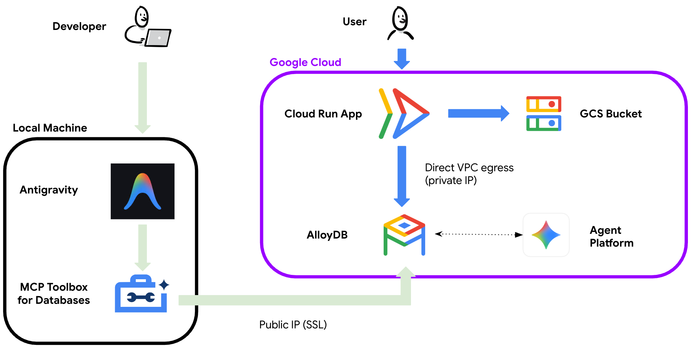

# Codelab: Vibe-Coding a Gastronomy Search App on Google Cloud (AlloyDB & Cloud Run)

In this codelab, you will learn how to build a modern, AI-powered restaurant search application called **Berlin AI Gastronomy Guide** using **Vibe Coding** (instructing an AI agent using natural language). 

You will start with a static Next.js frontend running on Google Cloud Run. Using an Agentic IDE (like Antigravity) connected directly to the **AlloyDB** Public IP via the official **AlloyDB MCP Server**, you will instruct the AI agent to:
1. Ingest a raw CSV dataset of Berlin restaurants.
2. Wire the Next.js frontend to the live database (Keyword Search).
3. Upgrade the search to use **Semantic Vector Search** (using Vertex AI embeddings in AlloyDB).
4. Apply production-grade database optimizations (HNSW Vector Index and Partitioning).

---

## 🏗️ Architecture



- **Frontend**: Next.js deployed on **Google Cloud Run** with Direct VPC Egress enabled (connecting to AlloyDB's Private IP).
- **Database**: **AlloyDB** running in your VPC, configured with **both Private IP** (for Cloud Run) and **Public IP** with SSL (for local IDE access).
- **Assets**: Restaurant images hosted in a public Google Cloud Storage (GCS) bucket.
- **AI Agent Connection**: Local IDE (Antigravity) connected directly to the AlloyDB Public IP via the **Postgres MCP** server (secured with SSL).
- **AI Integrations**: AlloyDB integrated with **Vertex AI** for in-database vector embedding generation.

---

## 📋 Phase 1: Prerequisites & Infrastructure Setup

Before starting the vibe-coding cycle, you must set up your local environment and deploy the baseline cloud infrastructure.

> [!TIP]
> **Use Antigravity's Integrated Terminal**: You can execute all terminal commands in this guide (such as `gcloud auth login`, deployment scripts, and Cloud Run deployments) directly inside **Antigravity's integrated terminal**!

### 1. Set Up your Local Environment & Authenticate
1. **Verify Google Cloud SDK (gcloud)**:
   Ensure you have the Google Cloud CLI installed. Run:
   ```bash
   gcloud --version
   ```
   *If it is not installed, download and install it from the [Google Cloud CLI Installation Guide](https://cloud.google.com/sdk/docs/install).*

2. **Verify Git**:
   Ensure you have Git installed. Run:
   ```bash
   git --version
   ```

3. **Clone the Repository**:
   Clone this repository to your local machine and navigate into the project directory:
   ```bash
   git clone https://github.com/mtoscano84/vibe-coding-postgres-mcp.git
   cd vibe-coding-postgres-mcp
   ```

4. **Authenticate with Google Cloud**:
   Log in to the gcloud CLI and set your active project:
   ```bash
   gcloud auth login
   gcloud config set project [YOUR_PROJECT_ID]
   ```

5. **Configure Cloud Build Permissions**:
   Grant the Compute Engine default service account the necessary roles for Cloud Build to compile and package the application:
   ```bash
   PROJECT_NUMBER=$(gcloud projects describe $(gcloud config get-value project) --format="value(projectNumber)")

   # Grant Storage Object Viewer (to read source code)
   gcloud projects add-iam-policy-binding $(gcloud config get-value project) \
       --member="serviceAccount:${PROJECT_NUMBER}-compute@developer.gserviceaccount.com" \
       --role="roles/storage.objectViewer"

   # Grant Log Writer (to write build logs)
   gcloud projects add-iam-policy-binding $(gcloud config get-value project) \
       --member="serviceAccount:${PROJECT_NUMBER}-compute@developer.gserviceaccount.com" \
       --role="roles/logging.logWriter"

   # Grant Artifact Registry Writer (to push container images)
   gcloud projects add-iam-policy-binding $(gcloud config get-value project) \
       --member="serviceAccount:${PROJECT_NUMBER}-compute@developer.gserviceaccount.com" \
       --role="roles/artifactregistry.writer"
   ```

### 2. Deploy the AlloyDB Cluster
We have provided an automated script to provision an AlloyDB cluster and instance configured with both Private and Public IP.
1. Run the deployment script from the root directory:
   ```bash
   bash database/deploy_alloydb.sh --region us-central1 --public-ip
   ```
2. **Important**: Note the **Instance IP** and the **Initial Password** printed at the end of the script execution. You will need these to connect.

### 3. Deploy the Next.js Frontend to Cloud Run (State 0)
We will deploy the initial static version of the frontend to Cloud Run. It will run in the same VPC network as AlloyDB using **Direct VPC Egress**.
1. Enable the required APIs for Cloud Run and Cloud Build:
   ```bash
   gcloud services enable run.googleapis.com \
                          artifactregistry.googleapis.com \
                          cloudbuild.googleapis.com
   ```
2. Build and deploy the application (run this from the root directory):
   ```bash
   gcloud run deploy berlin-gastronomy-guide \
     --source frontend/ \
     --network=[YOUR_VPC_NETWORK] \
     --subnet=[YOUR_VPC_NETWORK] \
     --allow-unauthenticated \
     --region=us-central1
   ```
3. Once deployed, note the **Service URL** of your Cloud Run application.

---

## 🔌 Phase 2: Connecting your Agent to Google Cloud

To allow the AI agent in your IDE (Antigravity) to interact with the database, we will use the official Google Cloud **AlloyDB MCP Server**. 

Because the deployment script enabled **Public IP** on the AlloyDB instance, the MCP server can connect directly over the internet. The connection is automatically secured using IAM (leveraging your local `gcloud` credentials), so there is no need to run any local proxies or authorize your local IP address.

### 1. Authenticate your Environment
Before the MCP server can connect, ensure your terminal (e.g., Antigravity's integrated terminal) is authenticated with Google Cloud Application Default Credentials (ADC):
```bash
gcloud auth application-default login
```

### 2. Configure the MCP Toolbox in your IDE
To allow the AI agent to interact with the database, configure the AlloyDB MCP server in your IDE.
1. In Antigravity, open **Settings > MCP Servers > View raw config**.
2. Add the following configuration to the `mcpServers` block:
   ```json
   "alloydb-postgres": {
     "command": "npx",
     "args": [
       "-y",
       "@toolbox-sdk/server",
       "--prebuilt",
       "alloydb-postgres",
       "--stdio"
     ],
     "env": {
       "ALLOYDB_POSTGRES_PROJECT": "[YOUR_PROJECT_ID]",
       "ALLOYDB_POSTGRES_REGION": "us-central1",
       "ALLOYDB_POSTGRES_CLUSTER": "alloydb-aip-01",
       "ALLOYDB_POSTGRES_INSTANCE": "alloydb-aip-01-pr",
       "ALLOYDB_POSTGRES_DATABASE": "postgres",
       "ALLOYDB_POSTGRES_USER": "postgres",
       "ALLOYDB_POSTGRES_PASSWORD": "[YOUR_ALLOYDB_PASSWORD]"
     }
   }
   ```
3. Save the config. Your agent now has direct, secure access to your cloud database!

---

## 🌊 Phase 3: The Vibe Coding Codelab

Open the repository in your Agentic IDE (Antigravity). Open the Agent Chat and execute the following steps by prompting the agent.

### Step 1: Database Ingestion
We need to load the restaurant catalog into our database.
* **Prompt**:
  > Read the headers of `database/seed_data_berlin.csv` to determine column data types and create the `restaurants` table using the MCP tool `execute_sql`. Then, read the CSV rows locally and insert all 100 records into remote AlloyDB using a single batched multi-row `INSERT INTO ... VALUES (...), (...), ...;` statement via `execute_sql`. Do not print the CSV contents, row payloads, or SQL statements to the chat transcript.
* **Verification**:
  - The agent will read the CSV, analyze the schema, connect to AlloyDB, create the table, and insert the 100 restaurant records in a single batch without transcript bloat.

### Step 2: Connect Frontend to Database (Keyword Search)
Now we will wire the Next.js frontend to the live database.
* **Prompt**:
  > Connect our Next.js frontend to the `restaurants` table in the database using the `pg` library. Use a connection pool configured with environment variables: `DB_HOST`, `DB_USER` (postgres), `DB_PASS` (password is '[YOUR_PASSWORD]'), and `DB_NAME` (postgres). Replace the mock data in `page.tsx` with a live query, and implement keyword search on the name, category, and description. When testing or verifying queries, always use `LIMIT 3` and suppress quiet npm/build logs.
* **Verification**:
  - The agent will install the `pg` package, configure the connection pool, and update `page.tsx` to query the database dynamically.
  - Redeploy the application to Cloud Run so it connects to the database:
    ```bash
    gcloud run deploy berlin-gastronomy-guide \
      --source frontend/ \
      --network=[YOUR_VPC_NETWORK] \
      --subnet=[YOUR_VPC_NETWORK] \
      --set-env-vars="DB_HOST=[YOUR_ALLOYDB_PRIVATE_IP],DB_USER=postgres,DB_PASS=[YOUR_PASSWORD],DB_NAME=postgres" \
      --allow-unauthenticated \
      --region=us-central1
    ```
  - Open the Cloud Run Service URL. Try searching for "Burgermeister" or "Kebab" to verify that the keyword search works.

### Step 3: Enable Semantic Vector Search
Now, we want to allow users to search by describing the "vibe" (e.g., *"cozy place for a date"*).
* **Prompt**:
  > Upgrade our database to support Semantic Vector Search on the `restaurants` table based on the `description` column. Then, update our frontend search query to use vector similarity search. Execute embedding generation quietly without printing embedding vectors or SQL progress logs to chat.
* **Verification**:
  - The agent will use its custom skill to enable `vector` and `google_ml_integration`, register the Vertex AI embedding model, create the `embedding` column, generate the embeddings in-database, and update the query in `page.tsx` to use the cosine distance operator (`<=>`).
  - Redeploy the application to Cloud Run to apply the semantic search changes:
    ```bash
    gcloud run deploy berlin-gastronomy-guide \
      --source frontend/ \
      --network=[YOUR_VPC_NETWORK] \
      --subnet=[YOUR_VPC_NETWORK] \
      --set-env-vars="DB_HOST=[YOUR_ALLOYDB_PRIVATE_IP],DB_USER=postgres,DB_PASS=[YOUR_PASSWORD],DB_NAME=postgres" \
      --allow-unauthenticated \
      --region=us-central1
    ```
  - Open the Cloud Run Service URL. Try searching for *"a romantic dinner spot"* or *"quick bite after clubbing"* and verify that it returns semantically relevant results (even if the exact keywords are not in the text!).

### Step 4: Database Optimization (Virtual DBA)
Optimize the database to scale to 100K+ rows and handle high concurrent search traffic.
* **Prompt**:
  > Act as my Principal Database Architect! Our semantic search is feeling great, but let's level up our backend to effortlessly scale to 100K+ rows and handle high concurrent traffic. Inspect our `restaurants` schema quietly, and work your magic by immediately applying your top 2 production optimizations—an HNSW vector index and list partitioning by neighborhood—right now in this turn. No need to wait for approval! Keep the SQL logs clean and hit me with a crisp 3-bullet summary of how we just supercharged our database.
* **Verification**:
  - The agent will analyze the database, apply the **HNSW index** for the vector column and **List Partitioning** for the neighborhoods immediately, and return a concise 3-bullet summary without requiring a second approval turn.

---

## 🛠️ Building the Environment (Creator Guide)

If you need to regenerate the assets or redeploy the public GCS bucket in a new environment, follow these steps:

### 1. Generate Images Locally
If you want to regenerate the restaurant images, you can run the image generation script:
1. Ensure you are authenticated with Google Cloud:
   ```bash
   gcloud auth application-default login
   ```
2. Run the image generation script to populate `frontend/public/images/berlin/`:
   ```bash
   python3 scripts/generate_images_real.py
   ```

### 2. Upload to GCS and Make Public
To upload the generated images to a new GCS bucket and make them public:
1. Define your bucket name:
   ```bash
   export BUCKET_NAME="vibe-coding-berlin-images"
   ```
2. Create the bucket with Uniform Bucket-Level Access:
   ```bash
   gcloud storage buckets create gs://$BUCKET_NAME --location=us-central1 --uniform-bucket-level-access
   ```
3. Upload the images:
   ```bash
   gcloud storage cp -r frontend/public/images/berlin gs://$BUCKET_NAME/images/
   ```
4. Grant public read access to the bucket (bypassing Domain Restricted Sharing if needed by configuring this at the project/org level first):
   ```bash
   gcloud storage buckets add-iam-policy-binding gs://$BUCKET_NAME --member=allUsers --role=roles/storage.objectViewer
   ```
5. Update `GCS_BUCKET_NAME` in `scripts/generate_catalog.py` and run it to regenerate the CSV with the new GCS URLs:
   ```bash
   python3 scripts/generate_catalog.py
   ```